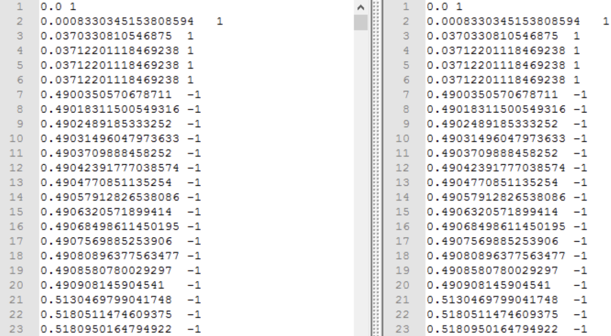
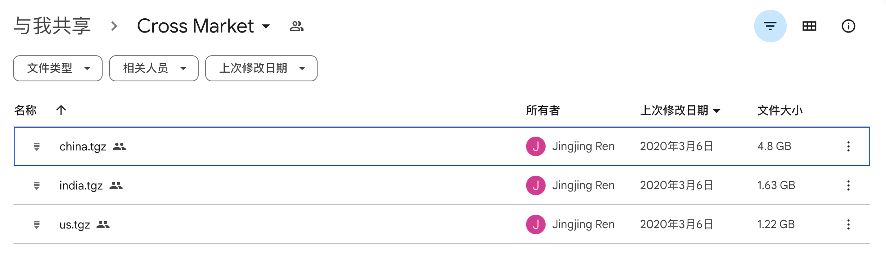
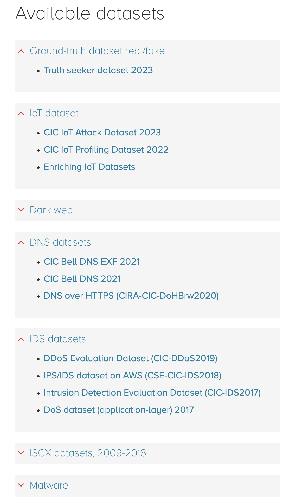
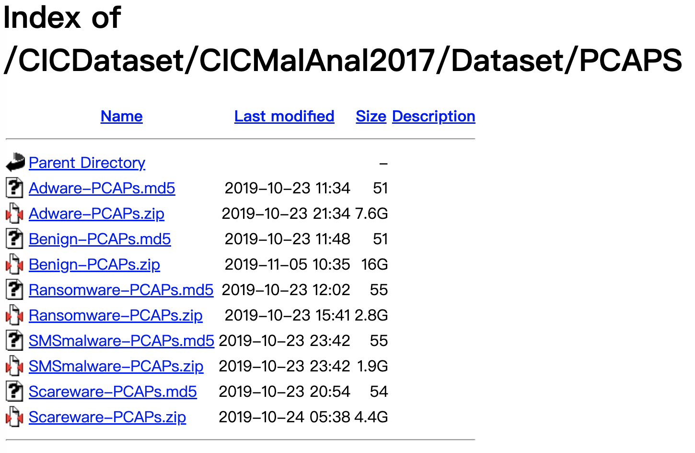
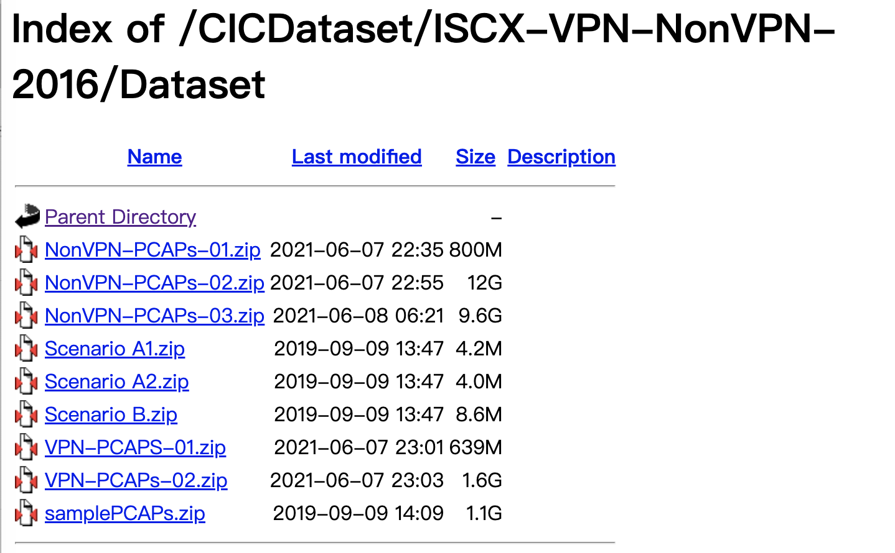
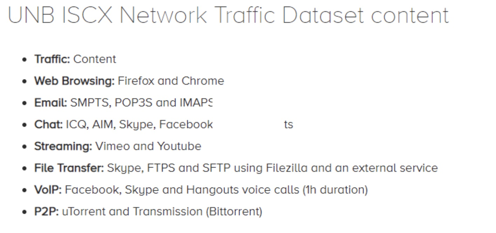
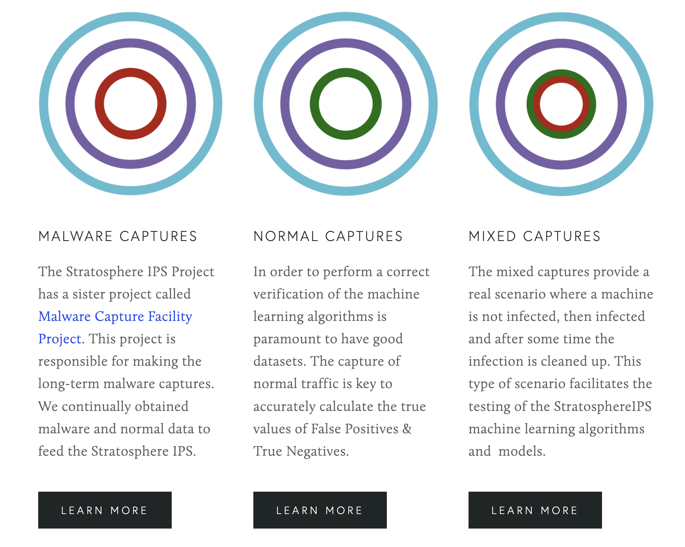
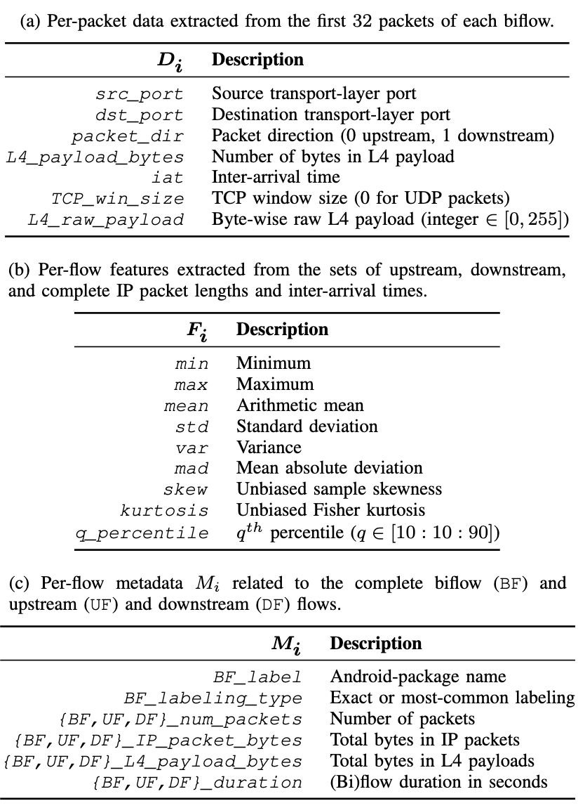
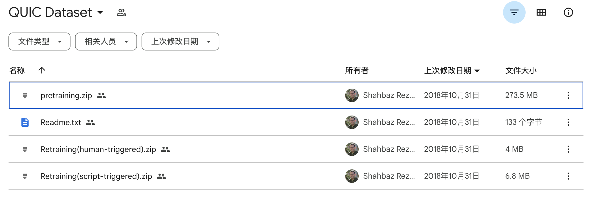

# AboutFlow
<center><font size="8">网络流量领域<br>工具库、公开数据集及加密流量解析方法</font></center>

# 工具库

## 流量解析

[flowcontainer 库](https://github.com/jmhIcoding/flowcontainer)

flowcontainer是基于python3的网络流量基本信息提取库，以方便完成网络流量的分析任务。给定pcap文件，该库会提取pcap所有的流的相关信息，其中流信息包括：流的源端口、源IP、目的IP、目的端口、IP数据包的长度序列、IP数据集的到达时间序列、有效载荷序列以及相应有效载荷的到达时间序列、等扩展信息。库会对IP数据包做过滤，那些tcp/udp载荷不为0的数据包会统计到有效载荷序列里面。工具简单易用，扩展性和复用性高。

## 加密流量分类方法库

[flowspot工具](https://github.com/jmhIcoding/traffic_classification_utils)

目前支持基于深度学习和机器学习的加密流量分类方法，目前已经集成如下方法：
目前本项目支持如下模型：

### 神经网络模型

- FS-Net

  [https://doi.org/10.1109/infocom.2019.8737507](https://doi.org/10.1109/infocom.2019.8737507)
  
  Liu, C., He, L., Xiong, G., Cao, Z., & Li, Z. (2019, April). Fs-net: A flow sequence network for encrypted traffic classification. In IEEE INFOCOM 2019-IEEE Conference On Computer Communications (pp. 1171-1179). IEEE.

- GraphDapp

  [https://doi.org/10.1109/tifs.2021.3050608](https://doi.org/10.1109/tifs.2021.3050608)
  
  Shen, M., Zhang, J., Zhu, L., Xu, K., & Du, X. (2021). Accurate decentralized application identification via encrypted traffic analysis using graph neural networks. IEEE Transactions on Information Forensics and Security, 16, 2367-2380.
  
- Deep Fingerprinting

  [https://dl.acm.org/doi/abs/10.1145/3243734.3243768](https://dl.acm.org/doi/abs/10.1145/3243734.3243768)
  
  Sirinam, P., Imani, M., Juarez, M., & Wright, M. (2018, October). Deep fingerprinting: Undermining website fingerprinting defenses with deep learning. In Proceedings of the 2018 ACM SIGSAC Conference on Computer and Communications Security (pp. 1928-1943).

- SDAE/LSTM/CNN

  [https://arxiv.org/pdf/1708.06376.pdf](https://arxiv.org/pdf/1708.06376.pdf)
  
  Rimmer, V., Preuveneers, D., Juarez, M., Van Goethem, T., & Joosen, W. Automated Website Fingerprinting through Deep Learning.

- Beauty

  [https://www.usenix.org/system/files/conference/usenixsecurity17/sec17-schuster.pdf](https://www.usenix.org/system/files/conference/usenixsecurity17/sec17-schuster.pdf)
  
  Schuster, R., Shmatikov, V., & Tromer, E. (2017). Beauty and the burst: Remote identification of encrypted video streams. In 26th USENIX Security Symposium (USENIX Security 17) (pp. 1357-1374).

- AppNet

  [https://doi.org/10.1109/infocomwkshps50562.2020.9162891](https://doi.org/10.1109/infocomwkshps50562.2020.9162891)
  
  Wang, X., Chen, S., & Su, J. (2020, July). App-net: A hybrid neural network for encrypted mobile traffic classification. In IEEE INFOCOM 2020-IEEE Conference on Computer Communications Workshops (INFOCOM WKSHPS) (pp. 424-429). IEEE.

- MIMETIC

  [https://www.sciencedirect.com/science/article/pii/S1389128619304669](https://www.sciencedirect.com/science/article/pii/S1389128619304669)
  
  Aceto, G., Ciuonzo, D., Montieri, A., & Pescapè, A. (2019). MIMETIC: Mobile encrypted traffic classification using multimodal deep learning. Computer networks, 165, 106944.

### 统计机器学习模型

- CUMUL

  [https://doi.org/10.14722/ndss.2016.23477](https://doi.org/10.14722/ndss.2016.23477)

  Panchenko, A., Lanze, F., Pennekamp, J., Engel, T., Zinnen, A., Henze, M., & Wehrle, K. (2016, February). Website Fingerprinting at Internet Scale. In NDSS.

- AppScanner

  [https://ieeexplore.ieee.org/abstract/document/7467370/](https://ieeexplore.ieee.org/abstract/document/7467370/)

  Taylor, V. F., Spolaor, R., Conti, M., & Martinovic, I. (2016, March). Appscanner: Automatic fingerprinting of smartphone apps from encrypted network traffic. In 2016 IEEE European Symposium on Security and Privacy (EuroS&P) (pp. 439-454). IEEE.

- BIND

  [https://dl.acm.org/doi/abs/10.1145/2991079.2991123](https://dl.acm.org/doi/abs/10.1145/2991079.2991123)

  Al-Naami, K., Chandra, S., Mustafa, A., Khan, L., Lin, Z., Hamlen, K., & Thuraisingham, B. (2016, December). Adaptive encrypted traffic fingerprinting with bi-directional dependence. In Proceedings of the 32nd Annual Conference on Computer Security Applications (pp. 177-188).

- RDP

  [https://doi.org/10.1109/IPCCC47392.2019.8958721](https://doi.org/10.1109/IPCCC47392.2019.8958721)

  Jiang, M., Gou, G., Shi, J., & Xiong, G. (2019, October). I know what you are doing with remote desktop. In 2019 IEEE 38th International Performance Computing and Communications Conference (IPCCC) (pp. 1-7). IEEE.


# 公开数据集

## 1. 马萨诸塞大学系列

http://traces.cs.umass.edu/index.php/Network/Network 

马萨诸塞大学系列系列：这个网站提供了该学院很多数据集，这些数据集是他们发表论文时提取的，然后公开出来。

### 1.1 WebIdent 2 Traces

数据集描述：

A collection of traces of web requests and responses over an encrypted SSH tunnel. The collection spans traces of connections to 2000 sites, collected four times a day over several months from February 2006 through April 2006. Each connection was encrypted; the traces include only the TCP headers, and not the payload.

2000个网站的SSH隧道上SSL连接的流量，只有TCP 头，PCAP大约2.5G 。
这个数据集是标注好了的。label: website。

地址：http://skuld.cs.umass.edu/traces/network/README-webident2


## 2. WIDE Project项目

http://mawi.wide.ad.jp/mawi/

该项目是日本和美国的合作项目，该项目会按照不同的时间周期（如每天的某分钟，每个月）采集从日本到美国的某条骨干网络的网络流量，里面一共涉及了7个采样点，其中C-D采样点采集的是IPv6的数据包。时间跨度特别大：从2001年到2018 都有。

网络流量做了数据脱敏，里面的IP地址是经过处理的，而且只有IP包头。

当然这个数据集更适合做测量，因为它是没有标注过的。


## 3. Youtube 加密视频流量标题识别数据集

数据集地址：
http://www.cse.bgu.ac.il/title_fingerprinting/
数据集描述：
作者采集了10000个Youtube视频流量，其中包含100个视频，每个视频观看100次。然后每个pcap，都有标注好对应的视频标题。pcap都没做数据脱敏，就是原始的pcap数据包。

例如：
http://www.cse.bgu.ac.il/title_fingerprinting/dataset_chrome_100/Hollyweezy/Train/
这个目录下有100个pcap,其中 Hollyweezy，就是他的视频标题。

同时作者该采集了一些带延时和丢包的数据包用来作为测试集。

作者的工作就是建立模型识别加密视频流量对应的视频标题。


## 4. 流量分析对抗实验数据集
这个数据集需要自己根据源码自己生成：
https://github.com/kpdyer/website-fingerprinting.git
源码生成的结果是会访问2000个 website 和775个SSH的Sockets代理的website的流量，里面的还有11个流量混淆的方法（包括包长填充等）可供选择，里面还有11个流量分类器。


## 5. 网络防御比赛的数据集

里面有SSL的数据包，尚未标注好的。可以作为协议格式自动化推断的数据包。

https://www.netresec.com/?page=MACCDC


## 6.Tor流量A
一般来说Tor上面的加密流量分类叫做webfingerprint attack,这个领域有很多公开的数据集，但是这个领域的很多数据集一般只给出cell的方向序列。例如：
[-1,1,1,-1,-1,…] 是{1,-1}的序列。正负号表示cell是Outgoing还是ingoing。每个cell的实际大小一般是512，因此可以根据cell的方向序列推断出cell的大小序列，只需要乘以512即可。
常见的数据集有：
###  6.1. AWF模型
https://github.com/jmhIcoding/DLWF?organization=jmhIcoding&organization=jmhIcoding

里面有 Closed World ，Open World ，Concept drift 等流量。有100，200,500,900个类别的分梯度的标注数据，每个类别有2500条数据。这个数据集还是很大的！

### 6.2. Deep fingerping数据集
https://github.com/deep-fingerprinting/df 

这个是深度学习的一个数据集，里面有95个类别。训练集有75000多个样本，测试集和验证集还各有9500条样本。


## 7. Tor流量B

http://home.cse.ust.hk/~taow/wf/data/
这里也是标注好的tor的website的流量，里面的数据都是基于cell的，都是+1，-1的序列。但是原始数据都带了相对时间戳。

有100多个类别，每个类别有100个左右的trace。



http://home.cse.ust.hk/~taow/wf/data/walkiebatch-defended.zip 是使用walkie-talkie手段构造的逃逸样本。


## 8. Andrubis 数据集

https://drive.google.com/drive/folders/1IXa3IJS9zJS4vggpyU7yda8f7jZjz4gB
介绍：
这个数据集超大，包含了103万个Android APP的带标注的流量数据，而且是pcap原始数据包。这个就很棒啊。

这个数据集包括了正常APP和恶意APP，是否正常是通过VirusTotal来判断的。
每个APP在Android模拟器里面跑4分钟。


## 9. Browser 数据集

https://drive.google.com/open?id=1wOdrfazbrcMDrL0NfA4GLoWegtPqkPj3
在三星Note4 安卓6.0.1设备上使用Chrome,Firefox,三星自带流量和UC浏览器访问Alexa Top 1000的站点。 每个站点访问15秒。
这里是为了分类不同的浏览器。

## 10.Cross Platform数据集

PPT链接：https://www.ndss-symposium.org/wp-content/uploads/2018/03/NDSS2018_05B-2_Ren_Slides.pdf

Cross Platform dataset: https://recon.meddle.mobi/cross-market.html
The Cross Platform dataset [51] consists of user-generated data for 215 Android and 196 iOS apps. The iOS apps were gathered from the top 100 apps in the App Store in the US, China and India. The Android apps originate from the top 100 apps in Google Play Store in the US and India, plus from the top 100 apps of the Tencent MyApps and 360 Mobile Assistant stores, as Google Play is not available in China. Each app was executed between three and ten minutes while receiving real user inputs. Procedures to install, interact,and uninstall the apps were given to student researchers who followed them to complete the experiments while collecting data. We use this dataset to evaluate both the performance of our method with user-generated data and the performance between different operating systems.

这个数据集做了相同APP不同版本之间的分析。

这个数据集有pcap文件。数据集有大约8个G



数据下载地址：https://drive.google.com/drive/folders/1cmG_5FIAh1DOGPI9el1K5WD9fUIpfw-x

## 11.ReCon dataset:

https://recon.meddle.mobi/appversions/

The ReCon AppVersions dataset [52, 53] consists of labeled network traces of 512 Android apps from the Google Play Store, including multiple version releases over a period of eight years. The traces were generated through a combination of automated and scripted interactions on five different Android devices. The apps were chosen among the 600 most popular free apps on the Google Play Store ranking within the top 50 in each category. In addition, this dataset contains extended traces of five apps, including multiple version releases. The network traffic of each of these five apps was captured daily over a two-week period. In this work, we refer the AppVersions dataset as ReCon and to the extended dataset as ReCon extended.

里面的数据主要是基于载荷的。

数据下载地址：https://recon.meddle.mobi/appversions/raw_data.tar.gz

## 12. CIC数据集

https://www.unb.ca/cic/datasets/

这个网站上面的数据集特别多，主要是一些入侵检测、恶意软件的数据集。

还有TOR的，这个可以！！！



### 12.1. Android 恶意软件流量

介绍页面：https://www.unb.ca/cic/datasets/andmal2017.html
数据页面：http://205.174.165.80/CICDataset/CICMalAnal2017/Dataset/PCAPS/

We installed 5,000 of the collected samples (426 malware and 5,065 benign) on real devices. Our malware samples in the CICAndMal2017 dataset are classified into four categories:

- Adware 广告软件
- Ransomware 勒索软件
- Scareware 恐吓软件
- SMS Malware 短信恶意软件

Our samples come from 42 unique malware families.

数据有426个恶意软件，5000多个正常软件的流量。

这些恶意软件可以分为4大类，共42个家族。



### 12.2 Investigation of the Android Malware (CICInvesAndMal2019)
这个数据集是对上面这个数据集的丰富，主要是把以下信息加进去了：
which includes permissions and intents as static features and API calls and all generated log files as dynamic features in three steps (During installation, before restarting and after restarting the phone).
APP的种类是没有变的。

### 12.3 Android Adware and General Malware Dataset
CICAAGM dataset is captured by installing the Android apps on the real smartphones semi-automated. The dataset is generated from 1900 applications with the following three categories。
有1900多个应用的流量，其中有400个恶意软件。其中剩余的1500多个应用可以当做普通app流量分类的openworld的数据集来使用。
https://www.unb.ca/cic/datasets/android-adware.html
这个数据集里面的广告软件特别多，有250个。

### 12.4 恶意URL数据集
URL: https://www.unb.ca/cic/datasets/url-2016.html
下载链接： http://205.174.165.80/CICDataset/ISCX-URL-2016/Dataset/ISCXURL2016.zip

Benign URLs: Over 35,300 benign URLs were collected from Alexa top websites.The domains have been passed through a Heritrix web crawler to extract the URLs. Around half a million unique URLs are crawled initially and then passed to remove duplicate and domain only URLs. Later the extracted URLs have been checked through Virustotal to filter the benign URLs.

Spam URLs: Around 12,000 spam URLs were collected from the publicly available WEBSPAM-UK2007 dataset.

Phishing URLs: Around 10,000 phishing URLs were taken from OpenPhish which is a repository of active phishing sites.

Malware URLs: More than 11,500 URLs related to malware websites were obtained from DNS-BH which is a project that maintain list of malware sites.

Defacement URLs: More than 45,450 URLs belong to Defacement URL category. They are Alexa ranked trusted websites hosting fraudulent or hidden URL that contains both malicious web pages.

### 12.5 VPN-noVPN 数据集
介绍链接：https://www.unb.ca/cic/datasets/vpn.html

下载链接：http://205.174.165.80/CICDataset/ISCX-VPN-NonVPN-2016/Dataset/

7大类网络服务，各自都有VPN和非VPN的流量：We captured a regular session and a session over VPN, therefore we have a total of 14 traffic categories: VOIP, VPN-VOIP, P2P, VPN-P2P, etc.



## 13. Stratosphere IPS数据集

https://www.stratosphereips.org/datasets-overview
这个IPS有提供比较多的数据集，更多是僵尸网络的数据集。



## 14. mirage数据集

这个数据集包含了20个移动应用的数据，主要有如下一些字段：

每条流前30个包的：包长序列、到达时间序列。

以及整条流的一些统计信息。



论文地址：http://wpage.unina.it/antonio.montieri/pubs/MIRAGE_ICCCS_2019.pdf
数据集网址：http://traffic.comics.unina.it/mirage/

因为这个数据集只分享了前30个IP数据包的长度，因此不适合做包长序列的模型，但是它暴露了前30个包的载荷。适合做以载荷为主要输入的模型。

label: 应用名


## 15. CRAWDAD apptraffic数据集
The traceset consists of 9 different Android video app packet captures and 1 mixed app packet capture on a Moto X 2nd generation smartphone.

9个安卓视频App，和一个混合的app 构成的待标注的数据集。

数据是原始的pcap文件，文件夹共5GB多。

label： 应用名
主页：https://crawdad.org/iitkgp/apptraffic/20151126/index.html


## 16. Quic数据集

https://drive.google.com/drive/folders/1Pvev0hJ82usPh6dWDlz7Lv8L6h3JpWhE

5个Google App，每个app有数百条流。



论文及github地址：https://github.com/jmhIcoding/Semi-supervised-Learning-QUIC-


## 17. 53个移动应用分类数据集

github地址：https://github.com/jmhIcoding/fgnet

这是[jmhIcoding](https://github.com/jmhIcoding)开源的一个数据集，里面包含两个子集：D1和D2。D2和D1共享相同的app，但是D2是一个月之后采集的，可以用来做版本更新的概率漂移适应的实验。D1和D2都包含了53个移动的流量，每个pcap已经解析为json，详情看github即可。

```json
@article{JIANG2022109309,
title = {Accurate mobile-app fingerprinting using flow-level relationship with graph neural networks},
journal = {Computer Networks},
pages = {109309},
year = {2022},
issn = {1389-1286},
doi = {https://doi.org/10.1016/j.comnet.2022.109309},
url = {https://www.sciencedirect.com/science/article/pii/S1389128622003577},
author = {Minghao Jiang and Zhen Li and Peipei Fu and Wei Cai and Mingxin Cui and Gang Xiong and Gaopeng Gou},
keywords = {Mobile encrypted traffic classification, Graph neural network},
abstract = {Identifying mobile applications (apps) from encrypted network traffic (also known as app fingerprinting) plays an important role in areas like network management, advertising analysis, and quality of service. Existing methods mainly extract traffic features from packet-level information (e.g. packet size sequence) and build up classifiers to obtain good performance. However, the packet-level information suffers from small discrimination for the common traffic across apps (e.g. advertising traffic) and rapidly changing for the traffic before and after apps’ updating. As a result, their performance declines in these two real scenes. In this paper, we propose FG-Net, a novel app fingerprinting based on graph neural network (GNN). FG-Net leverages a novel kind of information: flow-level relationship, which is distinctive between different apps and stable across apps’ versions. We design an information-rich graph structure, named FRG, to embed both raw packet-level information and flow-level relationship of traffic concisely. With FRG, we transfer the problem of mobile encrypted traffic fingerprinting into a task of graph representation learning, and we designed a powerful GNN-based traffic fingerprint learner. We conduct comprehensive experiments on both public and private datasets. The results show the FG-Net outperforms the SOTAs in classifying traffic with about 18% common traffic. Without retraining, FG-Net obtains the most robustness against the updated traffic and increases the accuracy by 5.5% compared with the SOTAs.}
}
```


> 基于[原文链接](https://blog.csdn.net/jmh1996/article/details/90666499)修改。
